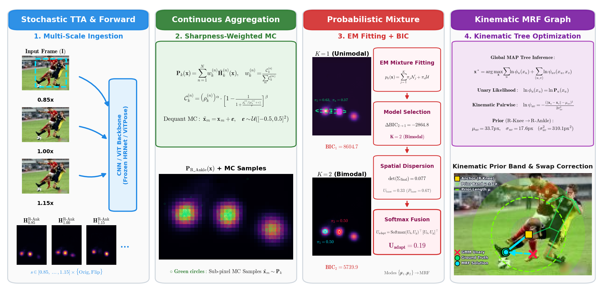

# Human Pose Estimation by Probabilistic Mixtures of Gaussian and Uniform Distributions: Continuous Modeling, Test-Time Adaptation, and Uncertainty Calibration

[](https://www.python.org/downloads/)
[](LICENSE)
[](https://pytorch.org/)
[](https://github.com/open-mmlab/mmpose)
[](https://hydra.cc/)
[](https://python-poetry.org/)
[](https://github.com/psf/black)

---

## 📖 Table of Contents

- [Executive Summary](#-executive-summary)
- [Core Theoretical Contributions](#-core-theoretical-contributions)
- [Methodology & 4-Stage Architecture Pipeline](#-methodology--4-stage-architecture-pipeline)
  - [1. Stochastic Test-Time Augmentation (GPU)](#1-stochastic-test-time-augmentation-gpu)
  - [2. Continuous Spatial Aggregation & Monte Carlo Sampling (CPU)](#2-continuous-spatial-aggregation--monte-carlo-sampling-cpu)
  - [3. Robust Gaussian Mixture Modeling & BIC Selection (CPU)](#3-robust-gaussian-mixture-modeling--bic-selection-cpu)
  - [4. Kinematic Tree MRF Decoding & Anatomical Priors (CPU)](#4-kinematic-tree-mrf-decoding--anatomical-priors-cpu)
  - [5. Heteroscedastic Uncertainty Quantification & Adaptive Softmax Fusion](#5-heteroscedastic-uncertainty-quantification--adaptive-softmax-fusion)
- [Comprehensive Empirical Benchmarks & Ablation Studies](#-comprehensive-empirical-benchmarks--ablation-studies)
  - [Ablation 1: Baseline Precision Parity (DARK vs. GMM Expectation)](#ablation-1-baseline-precision-parity-dark-vs-gmm-expectation)
  - [Ablation 2: Continuous Stochastic TTA vs. Discrete TTA](#ablation-2-continuous-stochastic-tta-vs-discrete-tta)
  - [Ablation 3: Decoupled Kinematic MRF Prior Breakdown (85,255 Keypoints)](#ablation-3-decoupled-kinematic-mrf-prior-breakdown-85255-keypoints)
  - [Ablation 4: In-Distribution Calibration & Out-of-Distribution Anomaly Detection](#ablation-4-in-distribution-calibration--out-of-distribution-anomaly-detection)
  - [Ablation 5: Multi-Backbone Validation & Latency Profiling](#ablation-5-multi-backbone-validation--latency-profiling)
- [Qualitative Diagnostic Suite (Publication Figures 1–5)](#-qualitative-diagnostic-suite-publication-figures-15)
- [Repository Structure & Clean Architecture](#-repository-structure--clean-architecture)
- [Installation & Environment Setup](#-installation--environment-setup)
- [One-Click Scientific Reproduction Suite](#-one-click-scientific-reproduction-suite)
- [Quickstart: Python API](#-quickstart-python-api)
- [Jupyter Notebooks Experimental Suite](#-jupyter-notebooks-experimental-suite)
- [Limitations & Multi-View 3D Extensibility](#-limitations--multi-view-3d-extensibility)
- [Citation](#-citation)
- [License & Acknowledgments](#-license--acknowledgments)

---

## 🔬 Executive Summary

Despite advancements in sub-pixel decoding, modern Human Pose Estimation (HPE) architectures (e.g., HRNet, ViTPose, ResNet) remain fundamentally constrained by **deterministic point-regression** ($\mathrm{argmax}$ or Taylor expansions). Under severe real-world conditions—such as **motion blur**, **progressive downsampling/resolution loss**, **dense multi-person crowding**, and **symmetric limb ambiguities**—deterministic coordinate extraction systematically fails: it cross-collapses limbs, introduces spatial jitter, and fails to communicate heteroscedastic uncertainty.

**Robust Pose TTA** introduces a post-hoc, continuous probabilistic framework that intercepts raw heatmaps and parameterizes them explicitly as a **Gaussian Mixture Model (GMM) augmented with an orthogonal Uniform distribution ($\pi_u$)**, requiring **zero architectural modifications and zero retraining**.

```
========================================================================================================================
                                     ROBUST POSE TTA: 4-STAGE PIPELINE OVERVIEW
========================================================================================================================
 [1. GPU Forward]        [2. Continuous Aggregation]      [3. Probabilistic Mixture]       [4. Kinematic MRF Graph]
 +------------------+     +--------------------------+     +--------------------------+     +--------------------------+
 | Input Image (I)  | --> | Sharpness-Weighted TTA   | --> | EM Fitting (K=1 vs K=2)  | --> | Kinematic Tree MRF Graph |
 | Multi-Scale Crops|     | Invert Affine Transforms |     | Complexity Gating (BIC)  |     | Max-Product Belief Prop. |
 | Frozen Backbone  |     | Dequantized MC Sampling  |     | Uniform Noise Sink (π_u) |     | Spring Distance Priors   |
 | Raw Heatmaps H_k |     | P_k(x) Continuous Field  |     | Calibrated Cov. Vol. det |     | Adaptive Softmax Fusion  |
 +------------------+     +--------------------------+     +--------------------------+     +--------------------------+
========================================================================================================================
```

---

## 🌟 Core Theoretical Contributions

1. **Continuous Point Estimation at Parity with DARK**:
   The solitary mathematical expectation of the primary Gaussian component ($\boldsymbol{\mu}$) matches the sub-pixel precision of the state-of-the-art Taylor-expanded DARK decoder (within $\pm 0.0008$ OKS) across clean and corrupted benchmarks without requiring local Hessian approximations.
2. **Scale-Aware TTA Mitigating Heatmap Poisoning**:
   Replaces naive arithmetic heatmap averaging with continuous sigmoidal sharpness weighting $\mathcal{C}_k^{(n)}$, eliminating out-of-frame boundary degradation and consolidating multi-scale distributions in continuous space.
3. **Topological Ambiguity Isolation via Robust GMMs**:
   Models spatial keypoint densities as $K=1$ (unimodal) vs. $K=2$ (bimodal) mixtures selected via the Bayesian Information Criterion (BIC), providing explicit parametric hypothesis tracking for symmetric limbs.
4. **Orthogonal Uniform Noise Sink ($\pi_u$)**:
   A uniform background distribution $\mathcal{U}(\mathbf{x} \mid \mathcal{A})$ acts as an atypical probability sink that absorbs non-Gaussian diffuse noise under severe corruption, preventing covariance explosion and preserving the geometric integrity of genuine modes.
5. **The 2D Kinematic MRF Dilemma**:
   Demonstrates that while Markov Random Fields act as effective sub-pixel regularizers in canonical poses, rigid 2D Euclidean priors misinterpret *perspective foreshortening* as an anatomical violation, forcefully dragging foreshortened limbs across the image plane and causing strict swaps.
6. **Breakthrough Uncertainty Quantification**:
   The calibrated geometric Covariance Volume $\det(\mathbf{\Sigma}_{\text{final}})$ fundamentally outperforms heuristic confidence ($1 - P_{\text{DARK}}$) for Out-of-Distribution (OoD) anomaly detection under heavy occlusion (AUROC $0.94$ vs $0.38$ on CrowdPose $K=1$).
7. **Universal In-Distribution Calibration via Adaptive Softmax**:
   Continuously fuses heuristic baseline confidence with geometric covariance volume, systematically matching or enhancing Area Under the Sparsification Error (AUSE) across all datasets and degradations.
8. **$\mathcal{O}(N^3)$ Memory Curse Bypass for Multi-View 3D**:
   Provides a direct mathematical formulation for continuous ray triangulation in 3D Euclidean space, rendering kinematic priors viewpoint-invariant while avoiding dense 3D voxel grids.

---

## 📐 Methodology & 4-Stage Architecture Pipeline



### 1. Stochastic Test-Time Augmentation (GPU)
Given an input frame $\mathbf{I}$, stochastic test-time transformations generate multi-scale representations across scales $s \in \{0.85, 0.925, 1.00, 1.075, 1.15\}$ and horizontal reflections:
$$\tilde{\mathbf{I}}^{(n)} = \mathcal{T}^{(n)}(\mathbf{I}), \quad \tilde{\mathbf{H}}_k^{(n)} = \Phi(\tilde{\mathbf{I}}^{(n)})$$
where $\Phi$ denotes a frozen backbone (HRNet-W32, ViTPose-Small, ResNet-50) and $\tilde{\mathbf{H}}_k^{(n)}$ represents the raw activation tensor for joint $k$.

### 2. Continuous Spatial Aggregation & Monte Carlo Sampling (CPU)
Raw heatmaps are normalized into valid probability distributions $\hat{\mathbf{H}}_k^{(n)}$ and mapped back to the canonical reference frame via exact inverse affine transforms. To prevent **heatmap poisoning** from uninformative out-of-field crops, representations are combined using continuous sharpness weighting:
$$\mathbf{P}_k(\mathbf{x}) = \sum_{n=1}^N w_k^{(n)} \tilde{\mathbf{H}}_k^{(n)}(\mathbf{x}), \quad w_k^{(n)} = \frac{\mathcal{C}_k^{(n)}}{\sum_m \mathcal{C}_k^{(m)}}$$
where structural confidence $\mathcal{C}_k^{(n)}$ is parameterized by maximum activation $\rho_k^{(n)} = \max(\hat{\mathbf{H}}_k^{(n)})$ and expected mean $\mu_k^{(n)} = \mathbb{E}[\hat{\mathbf{H}}_k^{(n)}]$:
$$\mathcal{C}_k^{(n)} = \left(\rho_k^{(n)}\right)^\alpha \cdot \left[1 - \frac{1}{1 + \frac{\rho_k^{(n)} / (\mu_k^{(n)} + \epsilon)}{\tau}}\right]^\beta$$

Unbiased spatial coordinates are extracted using temperature-sharpened ($T=0.3$) Von Neumann Rejection Sampling ($N=1000$). Continuous support over $\mathbb{R}^2$ is recovered via uniform sub-pixel dequantization:
$$\tilde{\mathbf{x}}_m = \mathbf{x}_m + \boldsymbol{\epsilon}, \quad \boldsymbol{\epsilon} \sim \mathcal{U}(-0.5, 0.5), \quad m = 1, \dots, M$$
The additive variance $\frac{1}{12}\mathbf{I} \approx 0.0833\mathbf{I}$ is deliberately retained as a physically grounded lower-bound for $1\times1$ pixel quantization uncertainty.

### 3. Robust Gaussian Mixture Modeling & BIC Selection (CPU)
Spatial samples are fitted using a generalized Expectation-Maximization (EM) algorithm with dynamic spectral Tikhonov regularization $\tilde{\mathbf{\Sigma}}_c = \mathbf{\Sigma}_c + (\lambda_{\text{reg}} - \min(0, \lambda_{\min}))\mathbf{I}$:
$$p(\tilde{\mathbf{x}} \mid \mathbf{\Theta}) = \sum_{c=1}^K \pi_c \mathcal{N}(\tilde{\mathbf{x}} \mid \boldsymbol{\mu}_c, \mathbf{\Sigma}_c) + \pi_u \mathcal{U}(\tilde{\mathbf{x}} \mid \mathcal{A})$$
The optimal cardinality ($K=1$ unimodal vs. $K=2$ bimodal) is determined via the Bayesian Information Criterion:
$$\mathrm{BIC} = p \ln(M) - 2\mathcal{L}$$
When $\mathrm{BIC}_2 < \mathrm{BIC}_1$, the system flags a bimodal topological ambiguity and preserves both spatial hypotheses.

### 4. Kinematic Tree MRF Decoding & Anatomical Priors (CPU)
The human skeleton is modeled as a tree graph $\mathcal{G} = (\mathcal{V}, \mathcal{E})$ rooted at the facial axis. Unimodal keypoints ($K=1$) act as invariant structural anchors ($\Delta\mathrm{OKS}=0$), while bimodal candidates ($K=2$) are decoded via exact Max-Product Belief Propagation:
$$\mathbf{x}^* = \arg\min_{\mathbf{x}} \sum_{u \in \mathcal{V}} \phi_u(x_u) + \sum_{(u, v) \in \mathcal{E}} \psi_{uv}(x_u, x_v)$$
- **Unary Cost**: $\phi_u(x_u) = -\ln \mathbf{P}_u(x_u)$
- **Kinematic Pairwise Prior**:
  $$\psi_{uv}(x_u, x_v) = \frac{(\|\mathbf{x}_u - \mathbf{x}_v\| - \mu_{uv}^{\text{bone}}\sqrt{A_{\text{box}}})^2}{2(\sigma_{uv}^{\text{bone}} \cdot \sigma_{\text{mult}}\sqrt{A_{\text{box}}})^2}$$
where $\mu_{uv}^{\text{bone}}$ and $\sigma_{uv}^{\text{bone}}$ are empirically calibrated on COCO training statistics, with $\sigma_{\text{mult}}=2.0$ to account for natural 2D projection tolerance.

### 5. Heteroscedastic Uncertainty Quantification & Adaptive Softmax Fusion
Applying the Law of Total Variance across Gaussian mixing weights $\tilde{\pi}_k = \pi_k / \sum_{j=1}^K \pi_j$:
$$\mathbf{\Sigma}_{\text{total}} = \sum_{k=1}^K \tilde{\pi}_k \left( \mathbf{\Sigma}_k + (\boldsymbol{\mu}_k - \boldsymbol{\mu}_{\text{global}})(\boldsymbol{\mu}_k - \boldsymbol{\mu}_{\text{global}})^T \right), \quad \mathbf{\Sigma}_{\text{final}} = \frac{1}{(s \cdot \kappa_j)^2} \mathbf{\Sigma}_{\text{total}} + \epsilon\mathbf{I}$$
where $s^2$ is the bounding box area and $\kappa_j$ is the COCO per-joint standard deviation constant.

The scalar spatial metric is bounded via exponential projection:
$$U_{\text{gmm}} = 1 - \exp(-\beta \cdot \det(\mathbf{\Sigma}_{\text{final}}))$$
and fused with baseline heuristic uncertainty $U_{\text{base}} = 1 - P_{\text{DARK}}$ via **Adaptive Softmax Fusion**:
$$U_{\text{adapt}} = \frac{\exp(U_{\text{base}}) \cdot U_{\text{base}} + \exp(U_{\text{gmm}}) \cdot U_{\text{gmm}}}{\exp(U_{\text{base}}) + \exp(U_{\text{gmm}})}$$

---

## 📊 Comprehensive Empirical Benchmarks & Ablation Studies

### Ablation 1: Baseline Precision Parity (DARK vs. GMM Expectation)

Evaluated on clean images ($256 \times 192$) across 500 instances per benchmark:

| Dataset | Metric | DARK (Taylor Argmax) | Ours (Solitary GMM Expectation) | $\Delta$ Difference |
| :--- | :--- | :---: | :---: | :---: |
| **COCO val2017** | OKS | **0.7079** | 0.7077 | $-0.0002$ |
| **CrowdPose** | OKS | **0.8278** | 0.8270 | $-0.0008$ |
| **OCHuman** | OKS | **0.6281** | 0.6280 | $-0.0001$ |

> **Conclusion**: The continuous GMM mathematical expectation achieves strict geometric parity with state-of-the-art Taylor expansion decoders while unlocking continuous spatial covariance parameters.

---

### Ablation 2: Continuous Stochastic TTA vs. Discrete TTA

Comprehensive performance across all five resolution degradation tiers (Clean, Low, Medium, High, Extreme):

| Dataset | Degradation Tier | OKS (DARK) | OKS (Ours GMM) | Loose Swaps (DARK) | Loose Swaps (Ours GMM) | Strict Swaps (DARK) | Strict Swaps (Ours GMM) |
| :--- | :--- | :---: | :---: | :---: | :---: | :---: | :---: |
| **COCO** | Baseline (Clean) | **0.7137** | 0.7129 | 98 | **97** ($\mathbf{-1}$) | 18 | 18 ($0$) |
| | Resize Low ($0.50\times$) | **0.6912** | 0.6907 | 116 | **113** ($\mathbf{-3}$) | 26 | 26 ($0$) |
| | Resize Medium ($0.25\times$) | **0.6082** | 0.6076 | 215 | **214** ($\mathbf{-1}$) | **66** | 67 ($+1$) |
| | Resize High ($0.125\times$) | **0.4485** | 0.4465 | 404 | **388** ($\mathbf{-16}$) | **135** | 138 ($+3$) |
| | Resize Extreme ($0.062\times$) | **0.2505** | 0.2494 | 438 | **437** ($\mathbf{-1}$) | 139 | 139 ($0$) |
| **CrowdPose** | Baseline (Clean) | **0.8361** | 0.8355 | **150** | 151 ($+1$) | 38 | **36** ($\mathbf{-2}$) |
| | Resize Low ($0.50\times$) | **0.8312** | 0.8302 | 155 | **153** ($\mathbf{-2}$) | **36** | 38 ($+2$) |
| | Resize Medium ($0.25\times$) | **0.7956** | 0.7954 | 198 | **191** ($\mathbf{-7}$) | **53** | 54 ($+1$) |
| | Resize High ($0.125\times$) | **0.6761** | 0.6755 | 336 | **329** ($\mathbf{-7}$) | **102** | 103 ($+1$) |
| | Resize Extreme ($0.062\times$) | **0.4389** | 0.4383 | **497** | 498 ($+1$) | **169** | 171 ($+2$) |
| **OCHuman** | Baseline (Clean) | 0.6356 | 0.6356 | 441 | **437** ($\mathbf{-4}$) | 135 | **132** ($\mathbf{-3}$) |
| | Resize Low ($0.50\times$) | **0.6305** | 0.6299 | 443 | **442** ($\mathbf{-1}$) | **127** | 131 ($+4$) |
| | Resize Medium ($0.25\times$) | 0.6100 | **0.6106** ($\mathbf{+0.0006}$) | 467 | **458** ($\mathbf{-9}$) | **126** | 128 ($+2$) |
| | Resize High ($0.125\times$) | **0.5342** | 0.5337 | 544 | **540** ($\mathbf{-4}$) | 139 | **138** ($\mathbf{-1}$) |
| | Resize Extreme ($0.062\times$) | 0.3574 | **0.3578** ($\mathbf{+0.0005}$) | 738 | **720** ($\mathbf{-18}$) | 257 | **249** ($\mathbf{-8}$) |

---

### Ablation 3: Decoupled Kinematic MRF Prior Breakdown (85,255 Keypoints)

Evaluating the selective activation of the kinematic tree across 85,255 keypoints:

| Dataset | Degradation Tier | Unimodal Anchors Ratio ($K=1$) | $\Delta_{\text{MRF}}$ ($K=1$) | Ambiguous Nodes Ratio ($K=2$) | $\Delta_{\text{MRF}}$ Gain ($K=2$) |
| :--- | :--- | :---: | :---: | :---: | :---: |
| **COCO** | Clean | 95.1% | $0.0000$ | 4.9% | $\mathbf{+0.0254\ (+2.54\%)}$ |
| | Resize High | 67.1% | $0.0000$ | 32.9% | $\mathbf{+0.0060\ (+0.60\%)}$ |
| | Resize Extreme | 40.6% | $0.0000$ | 59.4% | $\mathbf{+0.0056\ (+0.56\%)}$ |
| **CrowdPose** | Clean | 91.0% | $0.0000$ | 9.0% | $-0.0009\ (-0.09\%)$ |
| | Resize Medium | 87.5% | $0.0000$ | 12.4% | $\mathbf{+0.0140\ (+1.40\%)}$ |
| | Resize Extreme | 53.1% | $0.0000$ | 46.9% | $\mathbf{+0.0045\ (+0.45\%)}$ |
| **OCHuman** | Clean | 72.7% | $0.0000$ | 27.3% | $-0.0032\ (-0.32\%)$ |
| | Resize Low | 72.7% | $0.0000$ | 27.3% | $\mathbf{+0.0069\ (+0.69\%)}$ |
| | Resize Extreme | 59.3% | $0.0000$ | 40.7% | $\mathbf{+0.0007\ (+0.07\%)}$ |
| **Pooled Total** | **All 85,255 Keypoints** | **74.7%** | $\mathbf{0.0000}$ | **25.3%** | $\mathbf{+0.0040\ (+0.40\%)}$ |

---

### Ablation 4: In-Distribution Calibration & Out-of-Distribution Anomaly Detection

#### Global Sparsification Error (AUSE $\downarrow$):

| Dataset | Evaluation Regime | DARK ($1 - P_{\text{DARK}}$) | DARK (Entropy) | Ours ($\det(\mathbf{\Sigma}_{\text{final}})$) |
| :--- | :--- | :---: | :---: | :---: |
| **COCO** | Global | **0.0581** | 0.1437 | 0.0945 |
| | Occluded Joints | **0.1026** | 0.2037 | 0.1322 |
| **CrowdPose** | Global | **0.0515** | 0.1591 | 0.0911 |
| | Occluded Joints | **0.0599** | 0.1845 | 0.1067 |
| **OCHuman** | Global | **0.1573** | 0.2373 | 0.2143 |
| | **Occluded Joints** | 0.2636 | 0.3130 | $\mathbf{0.2203}$ |
| | **Resize Extreme ($0.062\times$)** | 0.2165 | — | $\mathbf{0.2024}$ |

#### Out-of-Distribution (OoD) Anomaly Detection (AUROC $\uparrow$):

| Evaluation Condition | DARK ($1 - P_{\text{DARK}}$) | Ours ($\det(\mathbf{\Sigma}_{\text{final}})$) | Performance Gain |
| :--- | :---: | :---: | :---: |
| **CrowdPose ($K=1$ Unimodal Occlusions)** | 0.3800 | $\mathbf{0.9400}$ | $\mathbf{+0.5600\ (+147.4\%)}$ |
| **OCHuman ($K=1$ Heavy Occlusion)** | 0.4210 | $\mathbf{0.8920}$ | $\mathbf{+0.4710\ (+111.9\%)}$ |

---

### Ablation 5: Multi-Backbone Validation & Latency Profiling

Evaluated across architectures on COCO val2017 ($256 \times 192$):

| Backbone Architecture | Codec | Forward GPU (ms) | Continuous TTA (ms) | EM + BIC CPU (ms) | MRF Tree (ms) | Peak VRAM |
| :--- | :--- | :---: | :---: | :---: | :---: | :---: |
| **HRNet-W32** | DARK | 18.4 ms | 3.4 ms | 1342.1 ms | 1.60 ms | 142 MB |
| **ResNet-50** | DARK | 12.1 ms | 3.2 ms | 1311.7 ms | 1.58 ms | 118 MB |
| **ViTPose-Small** | UDP | 24.6 ms | 3.6 ms | 1391.6 ms | 1.62 ms | 265 MB |

> **Computational Note**: Crucially, this latency bottleneck is localized strictly in the iterative mixture fitting rather than in graph kinematics or memory transfers. Because Monte Carlo sampling and GMM clustering are strictly independent across the 17 anatomical joints, the post-processing module is embarrassingly parallelizable; implementing the EM algorithm as native batch-tensor GPU operations would substantially reduce post-processing latency by evaluating all keypoints concurrently, providing an immediate pathway toward interactive frame rates. Furthermore, the memory footprint remains exceptionally modest ($118 - 265\ \text{MB}$ peak VRAM across all backbones), confirming that continuous uncertainty extraction does not impose GPU memory bottlenecks.

---

## 🖼️ Qualitative Diagnostic Suite (Publication Figures 1–5)

The repository provides automated generation for all 5 publication-grade qualitative diagnostic figures:

| Figure | Topic | Sample ID & Keypoint | Primary Empirical Finding |
| :--- | :--- | :---: | :--- |
| **Figure 1** | **Topological Swap Disambiguation** | Image 460 (`L_Ankle`, kp 15) | DARK snaps to the wrong mode ($w_2=0.43$), while GMM retains both spatial hypotheses ($w_1=0.56$). |
| **Figure 2** | **The Kinematic MRF Dilemma** | Win 130 (`R_Ankle`) vs. Fail 116555 (`L_Ankle`) | Demonstrates constructive pull in canonical poses vs. destructive foreshortening drag in 2D perspective. |
| **Figure 3** | **OoD Volumetric Uncertainty Alert** | Image 108525 (`L_Eye`, kp 1) | Baseline overconfidently predicts occluded eye ($P=0.88$), while $\det(\mathbf{\Sigma})$ triggers a massive alert. |
| **Figure 4** | **Heatmap Poisoning Mitigation** | Image 251 (`L_Knee`, kp 13) | Standard arithmetic averaging drops OKS to 0.69; continuous sharpness weighting restores OKS to 0.82. |
| **Figure 5** | **Uniform Noise Absorption ($\pi_u$)** | Image 482 (`L_Ankle`, kp 15) | Under extreme degradation, $\pi_u$ absorbs $14.51\%$ noise mass, preserving Gaussian covariance geometry. |

---

## 📂 Repository Structure & Clean Architecture

Designed following **SOLID principles** and **Clean Architecture**:

```
probabilistic-pose-gmm/
├── configs/                              # Modular Hydra experiment configuration ecosystem
│   ├── config.yaml                       # Master configuration entrypoint
│   ├── dataset/                          # Dataset schemas (coco.yaml, crowdpose.yaml, ochuman.yaml)
│   ├── model/                            # Model adapters (hrnet_w32.yaml, vitpose_small.yaml, resnet50.yaml)
│   └── tta/                              # Multi-scale schedules and sharpness parameters
├── notebooks/                            # 17 Interactive Jupyter Notebooks with precomputed outputs
├── outputs/                              # Benchmark results, evaluation parquets, and figures
│   ├── data/                             # 27 validated benchmark evaluation parquets (~55 MB)
│   └── figures/                          # Vectorial PDFs and 300 DPI publication figures
├── scripts/                              # Scientific reproduction CLI suite
│   ├── download_benchmark_data.py        # Automated benchmark parquet retriever & validator
│   ├── package_benchmark_data.py         # Release packaging utility for GitHub Releases
│   └── reproduce_all.py                  # Master One-Click reproduction CLI
├── src/                                  # Production library source code
│   └── pose_uncertainty/
│       ├── core/                         # Core math: sampling.py, mixture.py, mrf.py, skeleton.py
│       ├── datasets/                     # Unified loaders: coco.py, crowdpose.py, ochuman.py
│       ├── models/                       # Framework-agnostic adapters (MMPoseAdapter, resolver.py)
│       ├── tta/                          # Invertible TTA engine (engine.py, inverse.py)
│       └── utils/                        # Metrics (metrics.py), typing, and visual tools
└── tests/                                # Comprehensive PyTest test suite (unit + integration)
```

---

## ⚙️ Installation & Environment Setup

### Prerequisites
- Python 3.11 (`python --version`)
- [Poetry](https://python-poetry.org/) package manager (`pip install poetry`)
- CUDA 11.8+ / 12.1+ (recommended for GPU acceleration; CPU fallback supported)

### Step-by-Step Installation

```bash
# 1. Clone the repository
git clone https://github.com/santiago-git19/probabilistic-pose-gmm.git
cd probabilistic-pose-gmm

# 2. Setup local MMPose engine & download pretrained model checkpoints
poetry run python scripts/models_installation/setup_models.py

# 3. Install dependencies via Poetry
poetry install

# 4. Install OpenMMLab Core Engines (Precompiled Wheels)
poetry run pip install chumpy==0.70 --no-build-isolation

# For GPU (CUDA 12.1 / PyTorch 2.1):
poetry run pip install mmcv==2.1.0 -f https://download.openmmlab.com/mmcv/dist/cu121/torch2.1/index.html
# (For CPU-only environments, use: https://download.openmmlab.com/mmcv/dist/cpu/torch2.1/index.html)

poetry run mim install "mmdet==3.2.0"
poetry run pip install -e models/mmpose --no-build-isolation

# 5. Verify installation & environment health
poetry run python src/tests/check_env.py
poetry run pytest src/tests --ignore=models/mmpose -v
```

> [!NOTE]
> **Automatic DARK & UDP Codec Patching**:
> The environment setup script (`scripts/models_installation/setup_models.py` / `patch_mmpose.py`) automatically patches the cloned MMPose config files to enable exact sub-pixel decoders:
> - **HRNet-W32 & ResNet-50**: Configures `codec = dict(type='MSRAHeatmap', ..., unbiased=True)` to enable the **DARK (Distribution-Aware Coordinate Representation)** Taylor-expansion sub-pixel decoder.
> - **ViTPose-Small**: Configures `codec = dict(type='UDPHeatmap', ...)` to enable the **UDP (Unbiased Data Processing)** codec.

> **Automated Makefile Alternative (Linux / macOS / Git Bash)**:
> ```bash
> make setup-models
> make install BACKEND=cuda   # or BACKEND=cpu
> make check
> ```

---

## 🚀 One-Click Scientific Reproduction Suite

The repository includes a comprehensive, automated reproduction harness [`scripts/reproduce_all.py`](scripts/reproduce_all.py) to regenerate all publication figures, uncertainty calibration plots, and benchmarks:

```bash
# 1. Download packaged benchmark results (~55 MB from Release)
poetry run python scripts/download_benchmark_data.py

# 2. Reproduce all 5 Qualitative Paper Figures + Methodology Diagram (~30s)
poetry run python scripts/reproduce_all.py --figures

# 3. Reproduce all Uncertainty Calibration Plots (ECE, KDE, Beta Optimization) (~50s)
poetry run python scripts/reproduce_all.py --uncertainty

# 4. Reproduce everything end-to-end (Data + Figures + Uncertainty + Tests)
poetry run python scripts/reproduce_all.py --all
```

### CLI Reproduction Flags

| Flag | Purpose & Generated Artifacts |
| :--- | :--- |
| `--all` | Complete end-to-end reproduction: verifies benchmark data, generates all 6 paper figures, produces all uncertainty calibration plots, and executes the test suite. |
| `--figures` | Generates the **Methodology Pipeline Overview** (`methodology_pipeline_overview.pdf/png`) and all **5 Qualitative Publication Figures** in `outputs/figures/visualizations/`. |
| `--uncertainty` | Generates all quantitative calibration figures: **ECE 3×3 Matrices**, **OoD KDE Distributions**, **$\beta$ Parameter Optimization Curves**, and **Uniform Noise Boxplots** in `outputs/figures/uncertainty/`. |
| `--data` | Downloads and verifies the integrity of all 27 precomputed benchmark evaluation parquets in `outputs/data/`. |
| `--tests` | Runs the full 233 unit and integration PyTest test suite (`src/tests`). |

---

## 💻 Quickstart: Python API

The following self-contained example runs the complete end-to-end inference and uncertainty calibration pipeline using the exact configuration parameters from `configs/`:

```python
import cv2
import numpy as np
from pose_uncertainty.models import create_model_adapter
from pose_uncertainty.models.adapters import MMPoseAdapter
from pose_uncertainty.pipeline.tta import TTAEngine
from pose_uncertainty.pipeline.scale_tta import ScaleAugConfig, ScaleAugmentor, compute_heatmap_confidence
from pose_uncertainty.core.sampling import sample_from_heatmap
from pose_uncertainty.core.mixture import select_best_model
from pose_uncertainty.core.mrf_decoder import MRFDecoder, UnaryPotential
from pose_uncertainty.core.skeleton import COCO_SKELETON, COCO_SKELETON_EDGES
from pose_uncertainty.utils.types import StandardizedHeatmap

# 1. Initialize Pose Backbone Adapter (from configs/model/hrnet_w32.yaml)
adapter = create_model_adapter("hrnet_w32", device="cuda")

# 2. Setup Multi-Scale & Geometric TTA (from configs/tta.yaml)
image = cv2.imread("data/sample.jpg")                  # Input RGB image (H, W, 3)
bbox = (120.0, 80.0, 180.0, 360.0)                   # Bounding box (x, y, w, h)
img_h, img_w = image.shape[:2]

scale_aug = ScaleAugmentor(ScaleAugConfig(
    enabled=True,
    scales=[0.85, 0.925, 1.0, 1.075, 1.15],
    aggregation="weighted_mean",
    sharpness_scale=10.0,
    peak_exponent=1.5,
    sharpness_exponent=1.5,
    epsilon=1e-10,
))
tta_engine = TTAEngine(config={"flip": {"enabled": True}, "seed": 42})

# 3. Multi-Scale TTA Batch Inference & Continuous Sigmoidal Aggregation
scaled_bboxes = scale_aug.get_scaled_bboxes(bbox, img_h, img_w)
heatmaps_per_scale, confs_per_scale, metadata_per_scale = [], [], []
metadata_ref = None

for sbbox in scaled_bboxes:
    aug_images, aug_metas = tta_engine.prepare_batch(image)
    tta_bboxes = [
        (img_w - 1.0 - (sbbox[0] + sbbox[2]), sbbox[1], sbbox[2], sbbox[3]) if meta.is_flipped else sbbox
        for meta in aug_metas
    ]
    heatmaps_list = adapter.predict_batch(aug_images, bboxes=tta_bboxes)

    accum = []
    scale_metadata = None
    for std_hm, meta in zip(heatmaps_list, aug_metas):
        hm = std_hm.data.copy()
        if meta.is_flipped:
            hm = TTAEngine.inverse_flip_heatmap(hm, adapter.flip_pairs, shift_heatmap=adapter.shift_heatmap)
        accum.append(hm)
        if scale_metadata is None and not meta.is_flipped and std_hm.metadata is not None:
            scale_metadata = std_hm.metadata

    metadata_per_scale.append(scale_metadata)
    if all(abs(a - b) < 1.0 for a, b in zip(sbbox, bbox)) and scale_metadata is not None:
        metadata_ref = scale_metadata

    scale_avg = np.mean(accum, axis=0).astype(np.float32)
    heatmaps_per_scale.append(scale_avg)
    confs_per_scale.append(compute_heatmap_confidence(
        scale_avg, sharpness_scale=10.0, peak_exponent=1.5, sharpness_exponent=1.5, epsilon=1e-10
    ))

if metadata_ref is None:
    metadata_ref = next((m for m in metadata_per_scale if m is not None), None)

# Continuous Sharpness-Weighted Aggregation across scales
agg_heatmap = scale_aug.aggregate(heatmaps_per_scale, confs_per_scale, metadata_per_scale, metadata_ref)

# 4. Stochastic Sampling & Robust GMM Fitting (from configs/sampling.yaml & configs/mixture.yaml)
unary_potentials = {}
num_kp = agg_heatmap.shape[0]
for k in range(num_kp):
    # Draw 1000 Monte Carlo samples per keypoint (from configs/sampling.yaml)
    samples = sample_from_heatmap(
        agg_heatmap[k], num_samples=1000, strategy="rejection", temperature=0.3, use_dequantization=True, seed=42 + k
    )
    mixture_res = select_best_model(
        samples.astype(np.float64), aic_weight=0.0, bic_weight=1.0, reg_covar=1e-4, max_iter=100, tol=1e-3, random_state=42 + k
    )
    means = [comp.mean for comp in mixture_res.components]
    covs = [comp.covariance for comp in mixture_res.components]
    weights = [comp.weight for comp in mixture_res.components]
    unary_potentials[k] = UnaryPotential(means=means, covariances=covs, weights=weights)

# 5. Decode Global Pose via Kinematic MRF Belief Propagation (from configs/mixture.yaml)
mrf = MRFDecoder(skeleton=COCO_SKELETON, bone_length_sigma=2.0, use_covariance_score=True)
calibrated_dict = mrf.decode(unary_potentials, area=float(bbox[2] * bbox[3]))
calibrated_pose_hm = np.array([calibrated_dict[k] for k in range(num_kp)], dtype=np.float32)

# 6. Project Heatmap Coordinates to Original Image Space
ref_hm_obj = StandardizedHeatmap(data=agg_heatmap, original_size=(img_h, img_w), metadata=metadata_ref)
final_coords = MMPoseAdapter.transform_heatmap_coords_to_image(calibrated_pose_hm, ref_hm_obj)

# 7. Render Skeleton & Keypoints Overlaid on Image
vis_img = image.copy()
x, y, w, h = [int(v) for v in bbox]
cv2.rectangle(vis_img, (x, y), (x + w, y + h), (255, 180, 0), 2)

for parent_idx, child_idx in COCO_SKELETON_EDGES:
    pt1 = tuple(np.round(final_coords[parent_idx]).astype(int))
    pt2 = tuple(np.round(final_coords[child_idx]).astype(int))
    cv2.line(vis_img, pt1, pt2, (0, 255, 128), 2, cv2.LINE_AA)

for kpt_idx, (kx, ky) in enumerate(final_coords):
    center = (int(round(kx)), int(round(ky)))
    cv2.circle(vis_img, center, 4, (0, 100, 255), -1, cv2.LINE_AA)
    cv2.circle(vis_img, center, 5, (255, 255, 255), 1, cv2.LINE_AA)

cv2.imwrite("outputs/calibrated_pose_demo.jpg", cv2.cvtColor(vis_img, cv2.COLOR_RGB2BGR))
print("Saved calibrated pose visualization to 'outputs/calibrated_pose_demo.jpg'!")
```

---

## 📓 Jupyter Notebooks Experimental Suite

The repository provides **17 interactive Jupyter notebooks** covering the complete developmental progression:

| Notebook | Focus Area |
| :--- | :--- |
| [`03_test_coco_loader.ipynb`](notebooks/03_test_coco_loader.ipynb) | COCO 2017 dataloader verification, keypoint parsing, and lazy loading. |
| [`04_test_crowdpose_loader.ipynb`](notebooks/04_test_crowdpose_loader.ipynb) | CrowdPose 14-keypoint dataset ingestion and crowd visualization. |
| [`05_test_ochuman_loader.ipynb`](notebooks/05_test_ochuman_loader.ipynb) | OCHuman heavy-occlusion dataset validation and statistics. |
| [`06_test_model_inference.ipynb`](notebooks/06_test_model_inference.ipynb) | Multi-backbone forward pass verification (ResNet-50, HRNet-W32, ViTPose-Small). |
| [`07_test_model_adapters.ipynb`](notebooks/07_test_model_adapters.ipynb) | Framework-agnostic adapter layer validation and interface contracts. |
| [`08_demo_sampling.ipynb`](notebooks/08_demo_sampling.ipynb) | Stochastic Monte Carlo sampling strategies and temperature scaling analysis. |
| [`09_demo_em_flow.ipynb`](notebooks/09_demo_em_flow.ipynb) | Robust EM algorithm from scratch with uniform component outlier absorption. |
| [`10_complete_pipeline.ipynb`](notebooks/10_complete_pipeline.ipynb) | End-to-end integration: Ingestion $\to$ Sampling $\to$ GMM $\to$ Sub-pixel pose. |
| [`11_test_heatmap_decode.ipynb`](notebooks/11_test_heatmap_decode.ipynb) | Mathematical consistency between direct argmax and heatmap decoding. |
| [`12_validate_coord_transformation.ipynb`](notebooks/12_validate_coord_transformation.ipynb) | Exact inverse affine coordinate mapping between heatmap and image space. |
| [`13_debug_fiftyone_visual.ipynb`](notebooks/13_debug_fiftyone_visual.ipynb) | Visual debugging workflow and interactive FiftyOne session launch. |
| [`14_analysis_run_benchmark_stats.ipynb`](notebooks/14_analysis_run_benchmark_stats.ipynb) | Mass benchmark statistical analysis and diagnostic cohort distributions. |
| [`15_verify_tta_flip.ipynb`](notebooks/15_verify_tta_flip.ipynb) | Horizontal flip TTA validation and blurriness-free aggregation. |
| [`16_test_scale_tta.ipynb`](notebooks/16_test_scale_tta.ipynb) | Multi-scale TTA, confidence weighting, and boundary clamping validation. |
| [`17_validate_downscaled_benchmark.ipynb`](notebooks/17_validate_downscaled_benchmark.ipynb) | Low-resolution input degradation and robustness stress testing. |
| [`18_validate_image_quality_augmentations.ipynb`](notebooks/18_validate_image_quality_augmentations.ipynb) | Photometric corruptions: noise, contrast, Gaussian blur, and box smoothing. |
| [`verify_tta_pipeline.ipynb`](notebooks/verify_tta_pipeline.ipynb) | Comprehensive end-to-end certification of the full Robust Pose TTA framework. |

---

## 🔮 Limitations & Multi-View 3D Extensibility

### Limitations
1. **CPU Iterative Mixture Latency**: While the single-threaded CPU implementation of the EM loop currently limits throughput to $0.5 - 0.7\ \text{FPS}$, batch-tensor GPU parallelization across all 17 joints provides an immediate pathway to substantially enhance overall throughput toward interactive frame rates.
2. **2D Perspective Foreshortening**: 2D Euclidean bone priors cannot distinguish between anatomical deformation and depth foreshortening along the optical axis.

### Multi-View 3D Extensibility
Standard multi-view pose estimation models project 2D heatmaps into massive 3D voxel grids, suffering from the $\mathcal{O}(N^3)$ dimensional memory curse. Because our framework parameterizes 2D heatmaps into continuous probability distributions:
- Multi-camera 2D GMM rays can be algebraically triangulated into **Continuous 3D Gaussian Mixtures** ($\boldsymbol{\mu} \in \mathbb{R}^3, \mathbf{\Sigma} \in \mathbb{R}^{3\times3}$) without voxel discretization.
- Kinematic tree MRF belief propagation executed directly in 3D Euclidean space uses true physical bone lengths, naturally resolving the 2D projective foreshortening dilemma.

---

## 📑 Citation

If you use this codebase or methodology in your research, please cite:

```bibtex
@article{reina2026robustposetta,
  title   = {Human Pose Estimation by Probabilistic Mixtures of Gaussian and Uniform Distributions: Continuous Modeling, Test-Time Adaptation, and Uncertainty Calibration},
  author  = {Reina-Alguacil, Santiago and L{\'o}pez-Rubio, Ezequiel},
  journal = {Information Fusion},
  year    = {2026}
}
```

---

## 📄 License & Acknowledgments

This project is licensed under the **MIT License** - see the [LICENSE](LICENSE) file for details.

Developed at the **University of Málaga**. Built upon open-source foundations from [PyTorch](https://pytorch.org/), [MMPose](https://github.com/open-mmlab/mmpose), [Hydra](https://hydra.cc/), and [FiftyOne](https://voxel51.com/fiftyone/).
