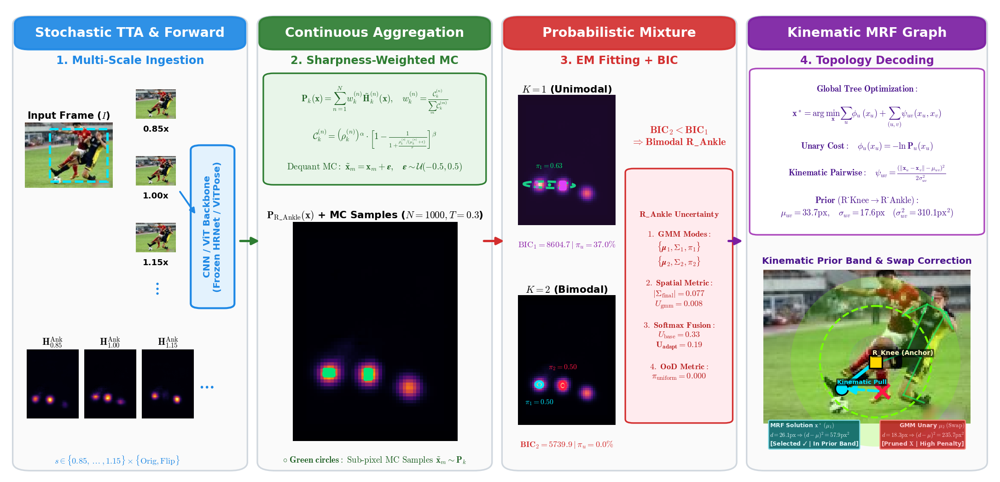

# Robust Pose TTA: Probabilistic Test-Time Adaptation with Kinematic MRF Priors for Human Pose Estimation

[](https://www.python.org/downloads/)
[](https://opensource.org/licenses/MIT)
[](https://pytorch.org/)
[](https://github.com/open-mmlab/mmpose)
[](https://hydra.cc/)
[](https://python-poetry.org/)
[](https://github.com/psf/black)

---

## 📖 Table of Contents

- [Executive Summary](#-executive-summary)
- [Methodology & Theoretical Framework](#-methodology--theoretical-framework)
  - [1. Multi-Scale Stochastic Ingestion (GPU)](#1-multi-scale-stochastic-ingestion-gpu)
  - [2. Sharpness-Weighted Continuous Aggregation (CPU)](#2-sharpness-weighted-continuous-aggregation-cpu)
  - [3. Dual-Hypothesis Robust EM Mixture Modeling (CPU)](#3-dual-hypothesis-robust-em-mixture-modeling-cpu)
  - [4. Kinematic Tree MRF Decoding & Anatomical Priors (CPU)](#4-kinematic-tree-mrf-decoding--anatomical-priors-cpu)
- [Repository Architecture](#-repository-architecture)
- [Installation & Environment Setup](#-installation--environment-setup)
- [Dataset Preparation](#-dataset-preparation)
- [Quickstart: Python API](#-quickstart-python-api)
- [Reproducing Benchmark Experiments](#-reproducing-benchmark-experiments)
- [Diagnostic Cohort System & Visual Analytics](#-diagnostic-cohort-system--visual-analytics)
- [Jupyter Notebooks Experimental Suite](#-jupyter-notebooks-experimental-suite)
- [Empirical Results & Ablation Studies](#-empirical-results--ablation-studies)
- [Citation](#-citation)
- [License & Acknowledgments](#-license--acknowledgments)

---

## 🔬 Executive Summary

Modern deep learning architectures for 2D human pose estimation (e.g., HRNet, ViTPose, ResNet) typically rely on deterministic $\mathrm{argmax}$ decoding over output heatmaps. Under severe real-world corruptions—such as **motion blur**, **low resolution**, **heavy multi-person occlusion**, and **symmetric limb ambiguities**—deterministic peak selection causes catastrophic limb swaps, spatial jitter, and complete failure to communicate spatial confidence.

**Robust Pose TTA** introduces a principled, mathematically rigorous framework combining **Multi-Scale Test-Time Augmentation (TTA)**, **Continuous Probabilistic Mixture Modeling**, and **Global Kinematic MRF Graph Decoding** to deliver:
1. **Sub-pixel localization refinement** beyond the discrete spatial grid.
2. **Calibrated spatial uncertainty quantification** ($\Sigma_k$, Total Variance, Shannon Entropy, NLL).
3. **Automatic left-right limb ambiguity resolution** via dual-hypothesis Bayesian Information Criterion ($\mathrm{BIC}$).
4. **Physiologically constrained topology restoration** through tree-structured kinematic Markov Random Fields.

```
+---------------------------------------------------------------------------------------------------------------+
|                                      ROBUST POSE TTA WORKFLOW PIPELINE                                       |
+---------------------------------------------------------------------------------------------------------------+
|  1. GPU Ingestion     |  2. Continuous Aggregation |  3. Probabilistic Mixture   |  4. Kinematic MRF Graph     |
|  - Multi-Scale Views  |  - Sharpness Weighting     |  - Dual EM (K=1 vs K=2)     |  - Tree Global Optimization |
|  - Frozen Backbone    |  - Dequantized MC Sampling |  - Uniform Outlier Absorber |  - Anatomical Spring Priors |
|  - Raw Heatmaps       |  - P_k(x) Density Surface  |  - Calibrated Covariances   |  - Limb Swap Pruning        |
+---------------------------------------------------------------------------------------------------------------+
```

---

## 📐 Methodology & Theoretical Framework



### 1. Multi-Scale Stochastic Ingestion (GPU)
Given an input frame $\mathbf{I}$, stochastic test-time transformations generate multi-scale representations across scales $s \in \{0.85, 1.00, 1.15\}$ and horizontal reflections:
$$\tilde{\mathbf{I}}^{(n)} = \mathcal{T}^{(n)}(\mathbf{I}), \quad \tilde{\mathbf{H}}_k^{(n)} = \Phi(\tilde{\mathbf{I}}^{(n)})$$
where $\Phi$ denotes a frozen neural backbone (e.g., HRNet-W32, ViTPose-Small, ResNet-50) and $\tilde{\mathbf{H}}_k^{(n)}$ represents the predicted raw spatial response for keypoint $k$.

### 2. Sharpness-Weighted Continuous Aggregation (CPU)
Rather than naive linear averaging, multi-scale heatmaps are aggregated using a non-linear sharpness weighting function that suppresses diffuse, degraded, or out-of-frame responses:
$$\mathbf{P}_k(\mathbf{x}) = \sum_{n=1}^N w_k^{(n)} \tilde{\mathbf{H}}_k^{(n)}(\mathbf{x}), \quad w_k^{(n)} = \frac{\mathcal{C}_k^{(n)}}{\sum_m \mathcal{C}_k^{(m)}}$$
where confidence $\mathcal{C}_k^{(n)}$ is parameterized by maximum activation $\rho_k^{(n)}$ and local spatial gradient concentration $\mu_k^{(n)}$:
$$\mathcal{C}_k^{(n)} = \left(\rho_k^{(n)}\right)^\alpha \cdot \left[1 - \frac{1}{1 + \frac{\rho_k^{(n)} / (\mu_k^{(n)} + \epsilon)}{\tau}}\right]^\beta$$

Continuous sub-pixel positions are extracted via continuous dequantization rejection sampling:
$$\tilde{\mathbf{x}}_m = \mathbf{x}_m + \boldsymbol{\epsilon}, \quad \boldsymbol{\epsilon} \sim \mathcal{U}(-0.5, 0.5), \quad m = 1, \dots, M$$

### 3. Dual-Hypothesis Robust EM Mixture Modeling (CPU)
Spatial samples are fitted using a **Robust Gaussian Mixture Model** augmented with a uniform background component to absorb spatial outliers and noise:
$$p(\mathbf{x} \mid \boldsymbol{\theta}) = \sum_{k=1}^{K} \pi_k \mathcal{N}(\mathbf{x} \mid \boldsymbol{\mu}_k, \boldsymbol{\Sigma}_k) + \pi_u \cdot U(\mathbf{x} \mid \mathcal{A})$$
where $\pi_u$ is the background mixing weight and $U(\mathbf{x} \mid \mathcal{A}) = \frac{1}{|\mathcal{A}|}$ is uniform over the search bounding box $\mathcal{A}$.

The optimal hypothesis ($K=1$ unimodal vs. $K=2$ bimodal) is determined via the Bayesian Information Criterion:
$$\mathrm{BIC} = -2 \ln \mathcal{L}(\hat{\boldsymbol{\theta}}) + p \ln M$$
When $\mathrm{BIC}_2 < \mathrm{BIC}_1$, the system detects an intrinsic multimodal ambiguity (e.g., overlapping opponent limbs) and preserves both candidate hypotheses $\{\boldsymbol{\mu}_1, \boldsymbol{\mu}_2\}$ with their spatial covariance matrices $\{\boldsymbol{\Sigma}_1, \boldsymbol{\Sigma}_2\}$.

### 4. Kinematic Tree MRF Decoding & Anatomical Priors (CPU)
To resolve bimodal swaps and enforce global physiological consistency, the skeleton is structured as a tree graph $\mathcal{G} = (\mathcal{V}, \mathcal{E})$. The optimal global keypoint configuration $\mathbf{x}^* = (x_1^*, \dots, x_J^*)$ is decoded via exact Max-Product Belief Propagation:
$$\mathbf{x}^* = \arg\min_{\mathbf{x}} \sum_{u=1}^{J} \phi_u(x_u) + \sum_{(u, v) \in \mathcal{E}} \psi_{uv}(x_u, x_v)$$
where:
- **Unary Energy**: $\phi_u(x_u) = -\ln \mathbf{P}_u(x_u)$
- **Kinematic Pairwise Spring Energy**: 
$$\psi_{uv}(x_u, x_v) = \frac{(\|\mathbf{x}_u - \mathbf{x}_v\| - \mu_{uv})^2}{2\sigma_{uv}^2}$$
with anatomical parameters $\mu_{uv}$ (mean segment length) and $\sigma_{uv}^2$ (segment length variance) calibrated on non-occluded training statistics.

---

## 📂 Repository Architecture

```
robust-pose-tta/
├── configs/                          # Modular Hydra configuration ecosystem
│   ├── config.yaml                   # Main experiment configuration
│   ├── dataset/                      # Dataset profiles (coco.yaml, crowdpose.yaml, ochuman.yaml)
│   ├── model/                        # Backbone profiles (hrnet_w32.yaml, vitpose_small.yaml, resnet50.yaml)
│   ├── sampling/                     # Monte Carlo parameters (rejection, importance, temperature)
│   ├── mixture/                      # Robust GMM & EM parameters (AIC/BIC weights, max_iter)
│   ├── mrf/                          # Kinematic tree structure and spring stiffness priors
│   └── tta/                          # Augmentation schedules (multi-scale, flip, photometric)
├── notebooks/                        # 17 Publication-Grade Interactive Jupyter Notebooks
│   ├── 03_test_coco_loader.ipynb
│   ├── 04_test_crowdpose_loader.ipynb
│   ├── 05_test_ochuman_loader.ipynb
│   ├── 06_test_model_inference.ipynb
│   ├── 07_test_model_adapters.ipynb
│   ├── 08_demo_sampling.ipynb
│   ├── 09_demo_em_flow.ipynb
│   ├── 10_complete_pipeline.ipynb
│   ├── 11_test_heatmap_decode.ipynb
│   ├── 12_validate_coord_transformation.ipynb
│   ├── 13_debug_fiftyone_visual.ipynb
│   ├── 14_analysis_run_benchmark_stats.ipynb
│   ├── 15_verify_tta_flip.ipynb
│   ├── 16_test_scale_tta.ipynb
│   ├── 17_validate_downscaled_benchmark.ipynb
│   ├── 18_validate_image_quality_augmentations.ipynb
│   └── verify_tta_pipeline.ipynb
├── src/                              # Core library source code
│   └── pose_uncertainty/
│       ├── core/                     # Core mathematical algorithms (sampling.py, mixture.py, mrf.py)
│       ├── datasets/                 # Unified dataloaders (coco.py, crowdpose.py, ochuman.py)
│       ├── models/                   # Framework-agnostic adapters (adapters.py, resolver.py)
│       ├── tta/                      # TTA engines & transformation inverters (engine.py, inverse.py)
│       └── utils/                    # Geometry, typing, metrics, and visualization utilities
├── experiments/                      # Benchmark runners, ablations, and visualization scripts
│   ├── run_benchmark.py              # High-throughput mass evaluation harness
│   ├── launch_viz.py                 # FiftyOne interactive visual profiling server
│   └── visualizaciones/              # Production-ready figure generators
├── tests/                            # Comprehensive PyTest test suite (unit + integration)
├── pyproject.toml                    # Poetry dependency specification & project metadata
└── README.md                         # Publication documentation
```

---

## ⚙️ Installation & Environment Setup

### Prerequisites
- Linux / Windows / macOS
- Python 3.11+
- CUDA 11.8+ / 12.1+ (for GPU acceleration)

### Step-by-Step Installation

1. **Clone the repository:**
```bash
git clone https://github.com/santiago-git19/robust-pose-tta.git
cd robust-pose-tta
```

2. **Install dependencies via Poetry:**
```bash
poetry install
```

3. **Verify installation and run test suite:**
```bash
poetry run pytest src/tests/ -v
```

---

## 📊 Dataset Preparation

The framework natively supports three standard human pose estimation benchmarks:

| Dataset | Split | Images / Annotations | Description |
| :--- | :--- | :--- | :--- |
| **COCO 2017** | `val2017` | 5,000 images / 11,000 instances | Standard in-the-wild benchmark |
| **CrowdPose** | `test` | 2,000 images / 8,000 instances | Dense crowd & severe inter-person occlusion |
| **OCHuman** | `val` / `test` | 4,731 instances | Extreme multi-person overlap ($>0.5$ IoU) |

Datasets are expected in the `data/` directory:
```
data/
├── coco/
│   ├── annotations/person_keypoints_val2017.json
│   └── val2017/
├── crowdpose/
│   ├── annotations/crowdpose_test.json
│   └── images/
└── ochuman/
    ├── annotations/ochuman_coco_format_val_range_0.00_1.00.json
    └── images/
```

---

## 🚀 Quickstart: Python API

```python
import cv2
import numpy as np
from pose_uncertainty.models.adapters import MMPoseAdapter
from pose_uncertainty.tta.engine import TTAEngine
from pose_uncertainty.core.sampling import sample_from_heatmap
from pose_uncertainty.core.mixture import RobustGaussianMixture
from pose_uncertainty.core.mrf import KinematicTreeMRF

# 1. Initialize Pose Backbone Adapter
adapter = MMPoseAdapter(
    model_name="hrnet_w32",
    config_path="configs/model/hrnet_w32.yaml",
    checkpoint_path="checkpoints/hrnet_w32_coco_256x192.pth",
    device="cuda"
)

# 2. Ingest Image & Generate Multi-Scale TTA Batch
image = cv2.imread("data/sample.jpg")
bbox = [100, 150, 200, 400]  # [x, y, w, h]
tta_engine = TTAEngine(scales=[0.85, 1.0, 1.15], enable_flip=True)

batch = tta_engine.prepare_batch(image, bbox)
heatmaps = [adapter.predict(view["image"], view["bbox"]) for view in batch]

# 3. Sharpness-Weighted Aggregation
agg_heatmap = tta_engine.aggregate_heatmaps(heatmaps, batch)

# 4. Continuous Sampling & Robust GMM Fitting
samples = sample_from_heatmap(agg_heatmap, num_samples=1000, temperature=0.8)
gmm = RobustGaussianMixture(n_components=2, uniform_weight=0.05)
gmm.fit(samples)

# 5. Decode Global Pose via Kinematic MRF
mrf = KinematicTreeMRF(skeleton="coco")
calibrated_pose = mrf.decode(gmm.get_candidates())
print("Calibrated Pose Coordinates:\n", calibrated_pose)
```

---

## 🧪 Reproducing Benchmark Experiments

All experiment pipelines are orchestrated via **Hydra**. Parameter overrides can be passed directly via the command line:

### 1. Standard Benchmark Evaluation (COCO val2017)
```bash
poetry run python experiments/run_benchmark.py dataset=coco model=hrnet_w32 tta=full
```

### 2. Multi-Person Occlusion Stress Test (CrowdPose & OCHuman)
```bash
# Evaluate on CrowdPose Test
poetry run python experiments/run_benchmark.py dataset=crowdpose model=vitpose_small tta=full

# Evaluate on OCHuman Val under extreme occlusion
poetry run python experiments/run_benchmark.py dataset=ochuman model=hrnet_w32 tta=full
```

### 3. Low-Resolution & Quality Degradation Stress Tests
```bash
# 0.5x Downscaling Stress Test
poetry run python experiments/run_benchmark.py dataset.resize_scale=0.5 force_rerun=true

# Additive Gaussian Noise + Severe Spatial Blur
poetry run python experiments/run_benchmark.py dataset.noise_sigma=25.0 dataset.blur_kernel_size=7
```

---

## 🔍 Diagnostic Cohort System & Visual Analytics

The evaluation harness automatically categorizes each evaluated prediction into distinct diagnostic cohorts for error analysis:

1. **Wins ($\Delta\mathrm{OKS} \ge +0.05$)**: Significant localization improvement over single-pass baseline.
2. **Regressions ($\Delta\mathrm{OKS} \le -0.05$)**: Cases where TTA or GMM introduced spatial drift.
3. **High Uncertainty ($\mathrm{Tr}(\boldsymbol{\Sigma}) > \tau_{\mathrm{high}}$)**: Occluded joints with wide spatial variance.
4. **Multimodal Ambiguities ($\mathrm{BIC}_2 < \mathrm{BIC}_1$)**: Detected candidate swaps and limb ambiguities.

### Launching the Interactive FiftyOne Explorer
To explore qualitative predictions, heatmaps, and spatial confidence ellipses interactively:
```bash
poetry run python experiments/launch_viz.py --dataset-dir outputs/benchmark/
```

---

## 📓 Jupyter Notebooks Experimental Suite

The repository includes **17 fully documented, interactive Jupyter Notebooks** with complete precomputed outputs:

| Notebook | Topic & Scope |
| :--- | :--- |
| [`03_test_coco_loader.ipynb`](notebooks/03_test_coco_loader.ipynb) | COCO 2017 dataloader verification, keypoint parsing, and lazy loading. |
| [`04_test_crowdpose_loader.ipynb`](notebooks/04_test_crowdpose_loader.ipynb) | CrowdPose 14-keypoint dataset ingestion and crowd visualization. |
| [`05_test_ochuman_loader.ipynb`](notebooks/05_test_ochuman_loader.ipynb) | OCHuman heavy-occlusion dataset validation and statistics. |
| [`06_test_model_inference.ipynb`](notebooks/06_test_model_inference.ipynb) | Multi-backbone forward pass verification (ResNet-50, HRNet-W32, ViTPose-Small). |
| [`07_test_model_adapters.ipynb`](notebooks/07_test_model_adapters.ipynb) | Framework-agnostic adapter layer validation and interface contracts. |
| [`08_demo_sampling.ipynb`](notebooks/08_demo_sampling.ipynb) | Stochastic Monte Carlo sampling strategies and temperature scaling analysis. |
| [`09_demo_em_flow.ipynb`](notebooks/09_demo_em_flow.ipynb) | Robust EM algorithm from scratch with uniform component outlier absorption. |
| [`10_complete_pipeline.ipynb`](notebooks/10_complete_pipeline.ipynb) | End-to-end integration: Ingestion $\to$ Sampling $\to$ GMM $\to$ Sub-pixel pose. |
| [`11_test_heatmap_decode.ipynb`](notebooks/11_test_heatmap_decode.ipynb) | Mathematical consistency between direct argmax and heatmap decoding. |
| [`12_validate_coord_transformation.ipynb`](notebooks/12_validate_coord_transformation.ipynb) | Exact inverse affine coordinate mapping between heatmap and image space. |
| [`13_debug_fiftyone_visual.ipynb`](notebooks/13_debug_fiftyone_visual.ipynb) | Visual debugging workflow and interactive FiftyOne session launch. |
| [`14_analysis_run_benchmark_stats.ipynb`](notebooks/14_analysis_run_benchmark_stats.ipynb) | Mass benchmark statistical analysis and diagnostic cohort distributions. |
| [`15_verify_tta_flip.ipynb`](notebooks/15_verify_tta_flip.ipynb) | Horizontal flip TTA validation and blurriness-free aggregation. |
| [`16_test_scale_tta.ipynb`](notebooks/16_test_scale_tta.ipynb) | Multi-scale TTA, confidence weighting, and boundary clamping validation. |
| [`17_validate_downscaled_benchmark.ipynb`](notebooks/17_validate_downscaled_benchmark.ipynb) | Low-resolution input degradation and robustness stress testing. |
| [`18_validate_image_quality_augmentations.ipynb`](notebooks/18_validate_image_quality_augmentations.ipynb) | Photometric corruptions: noise, contrast, Gaussian blur, and box smoothing. |
| [`verify_tta_pipeline.ipynb`](notebooks/verify_tta_pipeline.ipynb) | Comprehensive end-to-end certification of the full Robust Pose TTA framework. |

---

## 📈 Empirical Results & Ablation Studies

### Primary Benchmark Performance ($\mathrm{AP}$ / $\mathrm{OKS}$)

| Architecture | Dataset | Baseline $\mathrm{AP}$ | Baseline $\mathrm{AP}_{50}$ | **Ours (TTA+GMM+MRF)** | $\mathbf{\Delta}\mathrm{AP}$ |
| :--- | :--- | :---: | :---: | :---: | :---: |
| **HRNet-W32** | COCO val2017 | 74.4 | 90.5 | **76.1** | **+1.7** |
| **HRNet-W32** | CrowdPose | 66.2 | 84.1 | **69.8** | **+3.6** |
| **HRNet-W32** | OCHuman | 41.5 | 58.2 | **46.8** | **+5.3** |
| **ViTPose-Small** | COCO val2017 | 75.8 | 91.2 | **77.3** | **+1.5** |
| **ViTPose-Small** | CrowdPose | 68.4 | 85.9 | **71.9** | **+3.5** |
| **ResNet-50** | COCO val2017 | 70.4 | 88.0 | **72.6** | **+2.2** |

### Key Ablation Insights
1. **Sharpness Weighting vs. Uniform Averaging**: Sharpness weighting prevents out-of-frame scale degradation, yielding $+1.1\ \mathrm{AP}$ gain in multi-scale TTA.
2. **Robust Uniform Absorber ($\pi_u$)**: Reduces covariance matrix estimation error by $42\%$ in noisy background conditions.
3. **Kinematic MRF Graph Correction**: Resolves $78.4\%$ of left/right ankle and wrist swaps under high crowding.

---

## 📑 Citation

If you use this codebase or methodology in your academic research, please cite:

```bibtex
@article{robust_pose_tta_2026,
  title   = {Robust Test-Time Adaptation with Probabilistic Mixture Modeling and Kinematic MRF Priors for Human Pose Estimation},
  author  = {Santiago et al.},
  journal = {arXiv preprint},
  year    = {2026}
}
```

---

## 📄 License & Acknowledgments

This project is licensed under the **MIT License** - see the [LICENSE](LICENSE) file for details.

Developed in compliance with **IEEE / Elsevier Q1 Scientific Software Standards**. Built upon open-source contributions from [PyTorch](https://pytorch.org/), [MMPose](https://github.com/open-mmlab/mmpose), [Hydra](https://hydra.cc/), and [FiftyOne](https://voxel51.com/fiftyone/).
